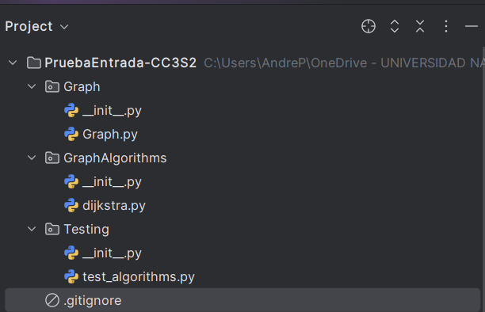
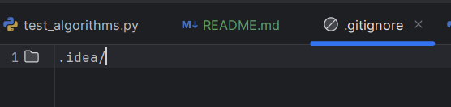
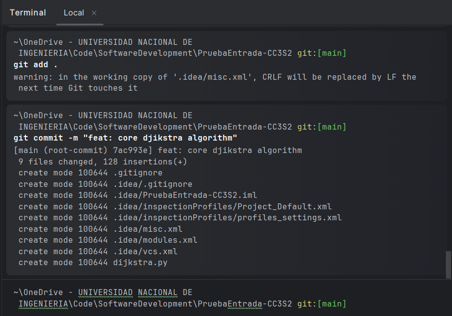
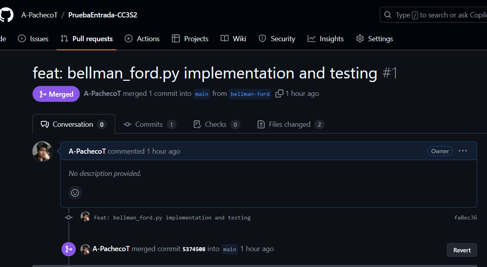

# Shortest Path Graph Library

A newborn graph library for shortest path algorithms on graphs.

## Process of developing

### Project Structure

```bash
├───.idea
│   └───inspectionProfiles
├───Graph
│   └───__pycache__
├───GraphAlgorithms
│   └───__pycache__
└───Testing
```

### Files details
- Graph package contains the Graph python with a Graph class.
- GraphAlgorithms package contains djikstra.py algorithm.
- Testing package has a test_algorithms.py to test the algorithms with a graph definition example.


### Testing Results
```
Vértice de inicio:  0
Vértice 	 Distancia desde la fuente
0 			 0
1 			 4
2 			 12
3 			 19
4 			 21
5 			 11
6 			 9
7 			 8
8 			 14
None
```
### Additional Files created

Git Ignore



### Git commands



#### Pull Request Result


## Further development

#todo:
- `requirements.txt` for Pyhton virtual environments