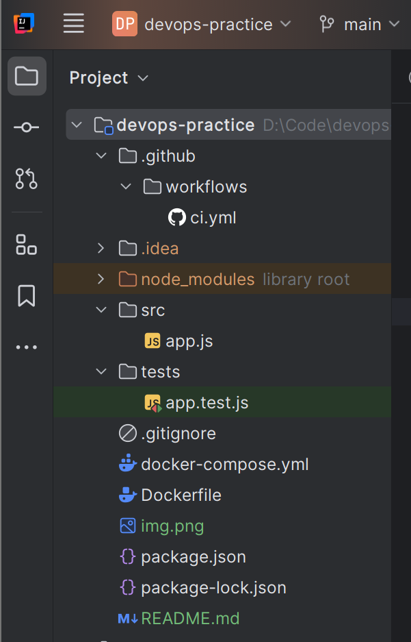
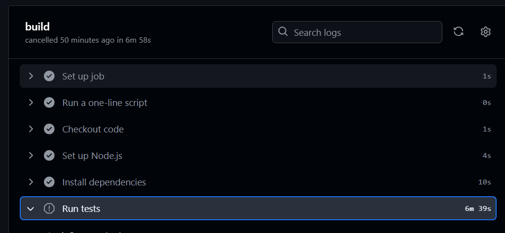
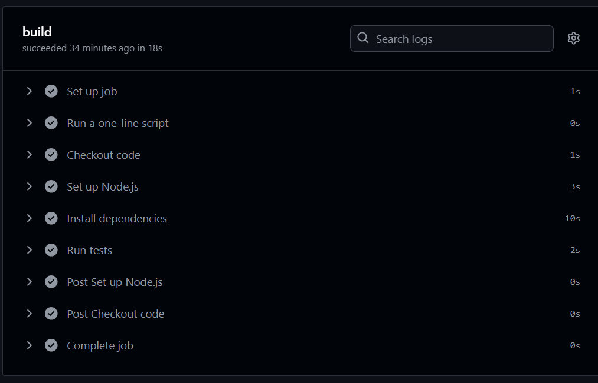
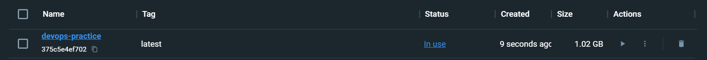
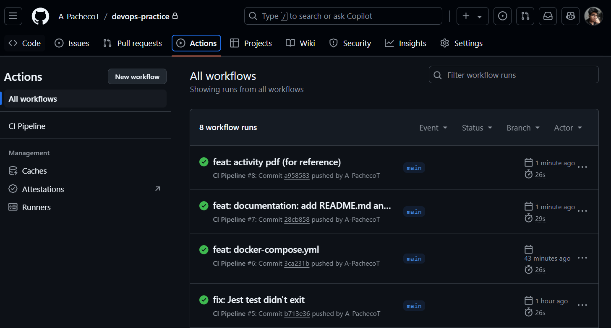
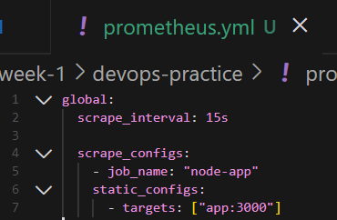
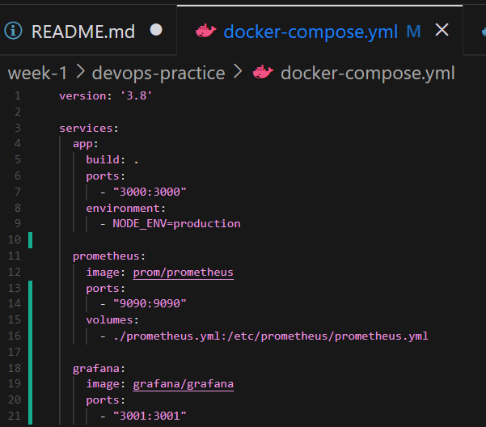
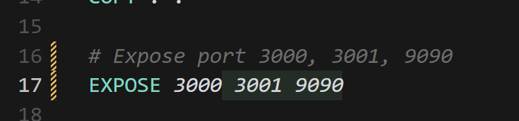
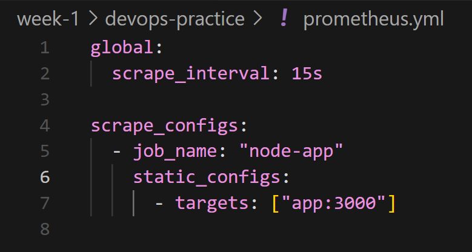

# DevOps Practice

## Laboratorio 1

### Documentación del Proceso de Implementación y Evaluación de CI/CD

#### Configuración del Entorno

El proyecto comenzó con la configuración de un entorno de desarrollo para una aplicación web básica utilizando Node.js. El objetivo fue establecer una API REST sencilla que devolviera un mensaje de "Hello, World!".


Los pasos seguidos incluyeron:

1. **Inicialización del Proyecto y Configuración**:

   - Se creó un directorio para el proyecto y se inicializó un nuevo proyecto de Node.js.
   - Se instalaron las dependencias necesarias, incluyendo Express para el manejo del servidor y Jest para las pruebas unitarias. Adicionalmente se observó que también se requería instalar `supertest` para poder realizar pruebas sobre la API.

2. **Creación de la Estructura del Proyecto**:

   - Se establecieron directorios separados para el código fuente (`src`) y las pruebas (`tests`).
     

   - Se implementó la API en `src/app.js` y se escribió una prueba básica en `tests/app.test.js` para asegurar que el endpoint funcionara correctamente.

3. **Modificaciones Realizadas**:

   - Se ajustó el mensaje de retorno del método GET para el root ('/') en `src/app.js` y `app.test.js`:

   ```javascript
   res.send("<h1>Hello World! 😉</h1>");
   ```

   ```javascript
   expect(res.text).toEqual("<h1>Hello World! 😉</h1>");
   ```

   - Se modificaron las pruebas para manejar la finalización del servidor después de cada ejecución, evitando problemas de recursos no liberados y conflictos de puertos.

   ```javascript
   // En app.test.js, dentro del describe...
   afterAll(async () => {
     server.close();
   });
   ```

   Antes de realizarse esto, al inicializar el test, el proceso nunca terminaba:

   ```bash
    > devops-practice@1.0.0 test
    > jest

    console.log
    Server running on port 3000

          at Server.<anonymous> (src/app.js:18:13)

    PASS  tests/app.test.js
    GET /
    √ should return Hello, World! (65 ms)

    Test Suites: 1 passed, 1 total
    Tests:       1 passed, 1 total
    Snapshots:   0 total
    Time:        1.487 s, estimated 2 s
    Ran all test suites.
    Jest did not exit one second after the test run has completed.

    This usually means that there are asynchronous operations that weren't stopped in your tests. Consider running Jest with `--detectOpenHandles` to troubleshoot this issue.
    ¿Desea terminar el trabajo por lotes (S/N)? s
   ```

   Así mismo, dentro del GitHub Action (tuve que cancelarlo):
   

#### Creación del Pipeline CI/CD

1. **Integración Continua (CI)**:
   - Se configuró GitHub Actions para automatizar las pruebas y el build cada vez que se realizan cambios, utilizando un archivo de configuración en `.github/workflows/ci.yml`.
   - Cada push al repositorio desencadena la ejecución de la integración continua, asegurando que el código en el repositorio esté siempre en un estado probado y funcional.
     Prueba del éxito de integración después de un push a main:
     
2. **Entrega Continua (CD)**:
   - Se utilizó Docker para contenerizar la aplicación, facilitando su despliegue en cualquier entorno sin preocupaciones de dependencias o configuraciones específicas del entorno de ejecución.
   - Se automatizó el despliegue utilizando Docker Compose y GitHub Actions para construir y ejecutar la imagen de Docker, asegurando que cualquier actualización en la rama principal desencadene un despliegue automatizado.

#### Resultados en Bash de Ejecución del Pipeline CI/CD

Al iniciar el contenedor con Dockerfile:

```bash
PS D:\Code\devops-practice> docker build -t devops-practice .
[+] Building 5.5s (11/11) FINISHED                                                                                                           docker:default
 => [internal] load build definition from Dockerfile                                                                                                   0.1s
 => => transferring dockerfile: 371B                                                                                                                   0.0s
 => [internal] load .dockerignore                                                                                                                      0.0s
 => => transferring context: 2B                                                                                                                        0.0s
 => [internal] load metadata for docker.io/library/node:14                                                                                             1.4s
 => [auth] library/node:pull token for registry-1.docker.io                                                                                            0.0s
 => [1/5] FROM docker.io/library/node:14@sha256:a158d3b9b4e3fa813fa6c8c590b8f0a860e015ad4e59bbce5744d2f6fd8461aa                                       0.0s
 => [internal] load build context                                                                                                                      0.8s
 => => transferring context: 536.75kB                                                                                                                  0.8s
 => CACHED [2/5] WORKDIR /app                                                                                                                          0.0s
 => CACHED [3/5] COPY package*.json ./                                                                                                                 0.0s
 => CACHED [4/5] RUN npm install                                                                                                                       0.0s
 => [5/5] COPY . .                                                                                                                                     1.9s
 => exporting to image                                                                                                                                 1.2s
 => => exporting layers                                                                                                                                1.1s
 => => writing image sha256:375c5e4ef702f9b7cbc44c25f8c680b01cdbadd3279a12772abbd734d16212ea                                                           0.0s
 => => naming to docker.io/library/devops-practice                                                                                                     0.0s

What's Next?
  View a summary of image vulnerabilities and recommendations → docker scout quickview
PS D:\Code\devops-practice> docker run -d -p 3001:3001 devops-practice
1f670465dc7132373d687a4c9d9410a22802b9446fbf497f9191ca2387c08bb7

```

En Docker Desktop:


Al iniciar el contenedor con docker-compose:

```bash
PS D:\Code\devops-practice> docker-compose up --build -d
[+] Building 9.2s (11/11) FINISHED                                                                                                           docker:default
 => [app internal] load build definition from Dockerfile                                                                                               0.0s
 => => transferring dockerfile: 371B                                                                                                                   0.0s
 => [app internal] load .dockerignore                                                                                                                  0.0s
 => => transferring context: 2B                                                                                                                        0.0s
 => [app internal] load metadata for docker.io/library/node:14                                                                                         1.5s
 => [app auth] library/node:pull token for registry-1.docker.io                                                                                        0.0s
 => [app 1/5] FROM docker.io/library/node:14@sha256:a158d3b9b4e3fa813fa6c8c590b8f0a860e015ad4e59bbce5744d2f6fd8461aa                                   0.0s
 => [app internal] load build context                                                                                                                  0.9s
 => => transferring context: 780.52kB                                                                                                                  0.9s
 => CACHED [app 2/5] WORKDIR /app                                                                                                                      0.0s
 => CACHED [app 3/5] COPY package*.json ./                                                                                                             0.0s
 => CACHED [app 4/5] RUN npm install                                                                                                                   0.0s
 => [app 5/5] COPY . .                                                                                                                                 5.5s
 => [app] exporting to image                                                                                                                           1.1s
 => => exporting layers                                                                                                                                1.1s
 => => writing image sha256:e02626addc78af5b75a6169b7ca504f0d8f9207e1c5a28ebd87dc26cd20502ab                                                           0.0s
 => => naming to docker.io/library/devops-practice-app                                                                                                 0.0s
[+] Running 2/2
 ✔ Network devops-practice_default  Created                                                                                                            0.1s
 ✔ Container devops-practice-app-1  Started                                                                                                            0.1s
```

Apagar docker-compose:

```bash
PS D:\Code\devops-practice> docker-compose down
[+] Running 2/2
 ✔ Container devops-practice-app-1  Removed                                                                                                           10.5s
 ✔ Network devops-practice_default  Removed                                                                                                            0.3s

```

#### Evaluación de la Experiencia

Aquí está mi reflexión sobre los beneficios y la reducción de fricción entre los equipos:

1. **Automatización de Pruebas y Despliegues**:
   - La integración continua con GitHub Actions asegura que cada cambio en el código se prueba automáticamente, lo cual previene la integración de código defectuoso en el repositorio principal. Esto elimina la necesidad de revisiones manuales extensivas y reduce la posibilidad de conflictos durante la integración del código, facilitando una base más estable para futuras iteraciones.
2. **Consistencia y Fiabilidad**:

   - Contenerizar la aplicación con Docker ha homogeneizado el entorno de ejecución, asegurando que la aplicación se ejecute de manera idéntica en cualquier máquina, desde el desarrollo hasta la producción. Esta consistencia elimina los típicos problemas de "funciona en mi máquina", reduciendo las discrepancias entre lo que ven los desarrolladores y el entorno de producción.

3. **Colaboración Mejorada**:

   - Al tener un proceso claramente definido y automatizado para pruebas y despliegues, se minimizan los malentendidos y conflictos sobre el estado y la calidad del software entre los equipos. Esto facilita una comunicación más fluida y eficaz, permitiendo que ambos equipos se enfoquen más en mejorar el producto y menos en resolver problemas operativos.

4. **Respuesta Rápida a Cambios**:
   - La capacidad de implementar rápidamente nuevas versiones del software a través del pipeline de CD permite al equipo adaptarse mejor a las necesidades cambiantes del negocio y resolver problemas críticos en tiempo real. Esto no solo mejora la capacidad de respuesta del equipo ante incidencias sino que también acelera el tiempo de entrega de nuevas características y correcciones.


Como pueden ver en la imagen, para los pushes a producción (main) que realice de aquí en adelante, se automatiza el despliegue de la aplicación con GitHub Actions. Ya no más revisiones manuales!!

## Laboratorio 2

### DevSecOps

#### Práctica 1: Implementación de Prometheus y Grafana

Se configura el prometheus:


- Se establece un intervalo de recopilación de métricas cada 15 segundos.
- El trabajo(job) se llama "node-app" y apunta al target "app:3000", que es la dirección IP y el puerto en el que la aplicación web estará expuesta.



Se tuvo que cambiar el dockerfile para que exponga los puertos 3000, 3001 y 9090:



Se agregó esta línea en el docker-compose.yml, en el servicio app:

```
  volumes:
    - ./app:/app
```

Esto permitirá que el contenedor de la aplicación tenga acceso al código fuente y no se tenga que reconstruir cada vez que se realicen cambios en el código. Se reinicia el servicio con `docker-compose restart app`.

Se cometieron errores de identación en prometheus.yml, en la línea 11, después de `scrape_configs:`.


